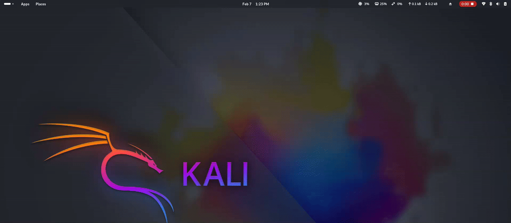
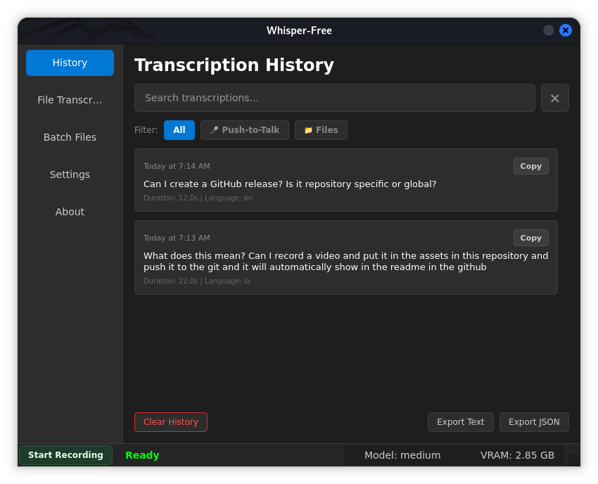
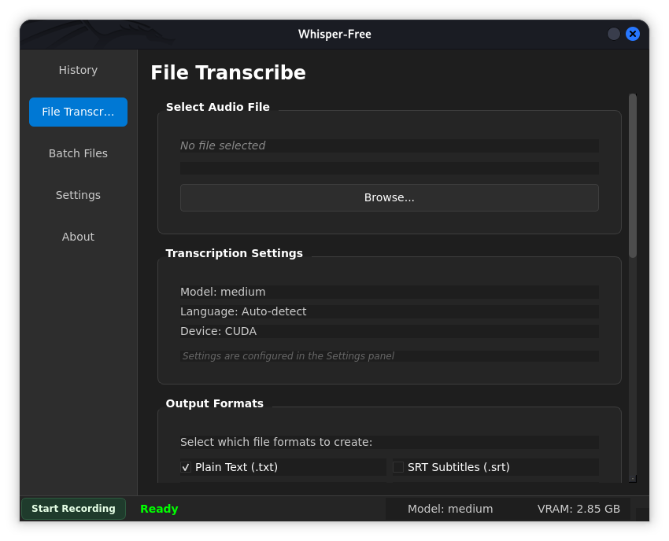
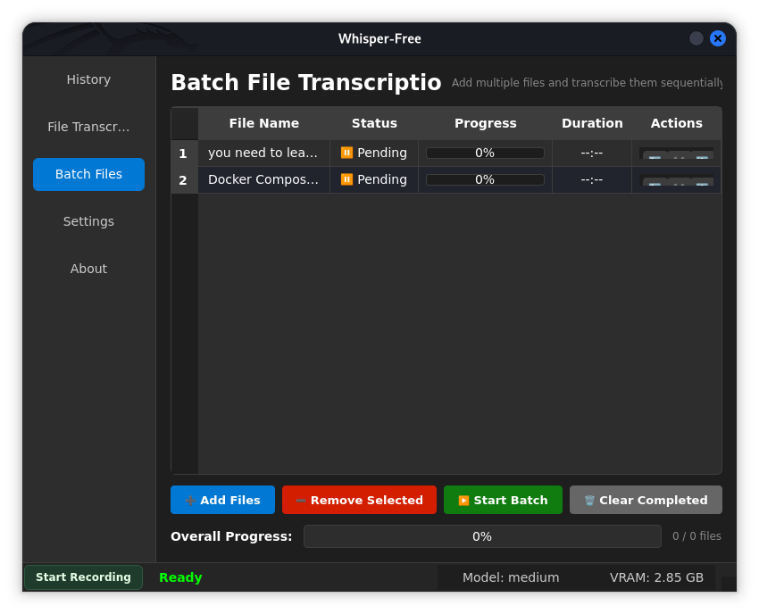
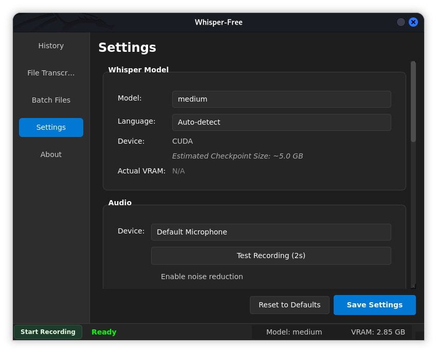
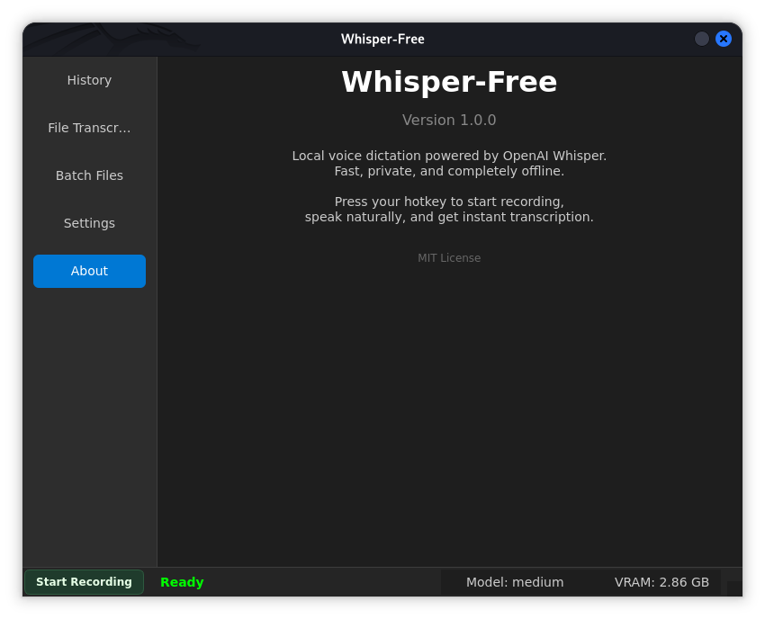

# Whisper-Free

Whisper-Free is a local, privacy-first speech-to-text desktop app with a lightweight Dynamic-Island-style overlay. It provides push-to-talk transcription, a clean UI for file transcription, and quick copy-to-clipboard workflows.

## Demo Video



## Screenshots

<table>
  <tr>
    <td></td>
    <td></td>
    <td></td>
  </tr>
  <tr>
    <td></td>
    <td></td>
    <td></td>
  </tr>
</table>

## Features

- Push-to-talk transcription with always-on-top overlay
- Live waveform + processing indicator
- Automatic clipboard copy on completion
- History panel of transcriptions
- File transcription (WAV/FLAC/OGG out of the box; MP3/M4A/WebM with ffmpeg)
- Configurable overlay position, monitor selection, and auto-dismiss timing

## Requirements

- Linux (tested on GNOME)
- Python 3.10+
- FFmpeg (required for MP3/M4A/WebM file transcription)
- Atleast 2GB VGA

## Install

```bash
# 1) Clone
git clone https://github.com/pradeep512/Whisper-free.git
cd whisper-free

# 2) Create venv
python -m venv venv
source venv/bin/activate

# 3) Install deps
pip install -r requirements.txt
```

Install ffmpeg if you plan to transcribe MP3/M4A/WebM:

```bash
sudo apt-get install ffmpeg
```

## Run

```bash
# Run directly
python -m app.main

# Or use the Makefile
make run
```

## Install CLI (`whisper` command)

```bash
make install
# Then run
whisper
```

## Wayland Note (GNOME)

On GNOME Wayland, precise overlay positioning is restricted. To keep the overlay pinned to the top-center, Whisper-Free automatically runs via XWayland when it detects Wayland.

- Default behavior on Wayland: uses XWayland for reliable positioning
- Force Wayland (for testing):

```bash
whisper --wayland
```

- Force XWayland explicitly:

```bash
whisper --xwayland
```

- Environment override:

```bash
# Always force XWayland
export WHISPER_FORCE_XWAYLAND=1

# Never force XWayland
export WHISPER_FORCE_XWAYLAND=0
```

## Hotkey Setup (GNOME)

1. Open Settings > Keyboard > Keyboard Shortcuts > Custom Shortcuts
2. Add a new shortcut:
   - Name: Whisper Toggle
   - Command: `whisper --toggle`
   - Shortcut: Ctrl+Space

This toggles recording start/stop and triggers transcription + clipboard copy.

## File Transcription

Open the "File Transcribe" tab and select an audio file. WAV/FLAC/OGG work without extra dependencies. For MP3/M4A/WebM, install ffmpeg.

See `archive/docs/README_FILE_TRANSCRIPTION.md` for detailed file transcription guidance.

## Troubleshooting

- Overlay stuck in the middle on GNOME Wayland: ensure XWayland mode is active (default). Try `whisper --xwayland`.
- MP3/M4A won't load: install ffmpeg.

## Project Layout

- `app/` main application code
- `app/ui/overlay.py` overlay UI
- `scripts/whisper` CLI entry point
- `configs/` config templates
- `assets/` optional demo video and media

## License

MIT
