# Whisper-Free

Whisper-Free is a local, privacy-first speech-to-text desktop app with a lightweight Dynamic-Island-style overlay. It provides push-to-talk transcription, a clean UI for file transcription, and quick copy-to-clipboard workflows.

## Demo Video

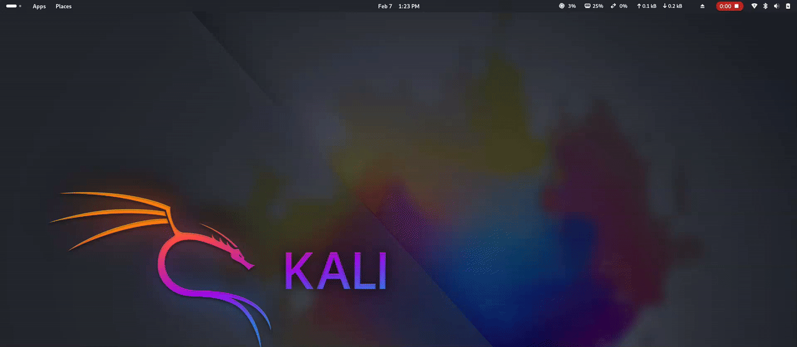

## Screenshots

### macOS (v1.0.0)

The Dynamic Island overlay shown live during recording (waveform, cancel `×`, stop `■`):

<p align="center">
  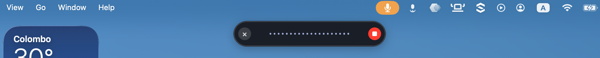
</p>

The main window — menu bar agent app with sidebar nav, coral-orange accent, dark theme:

<table>
  <tr>
    <td>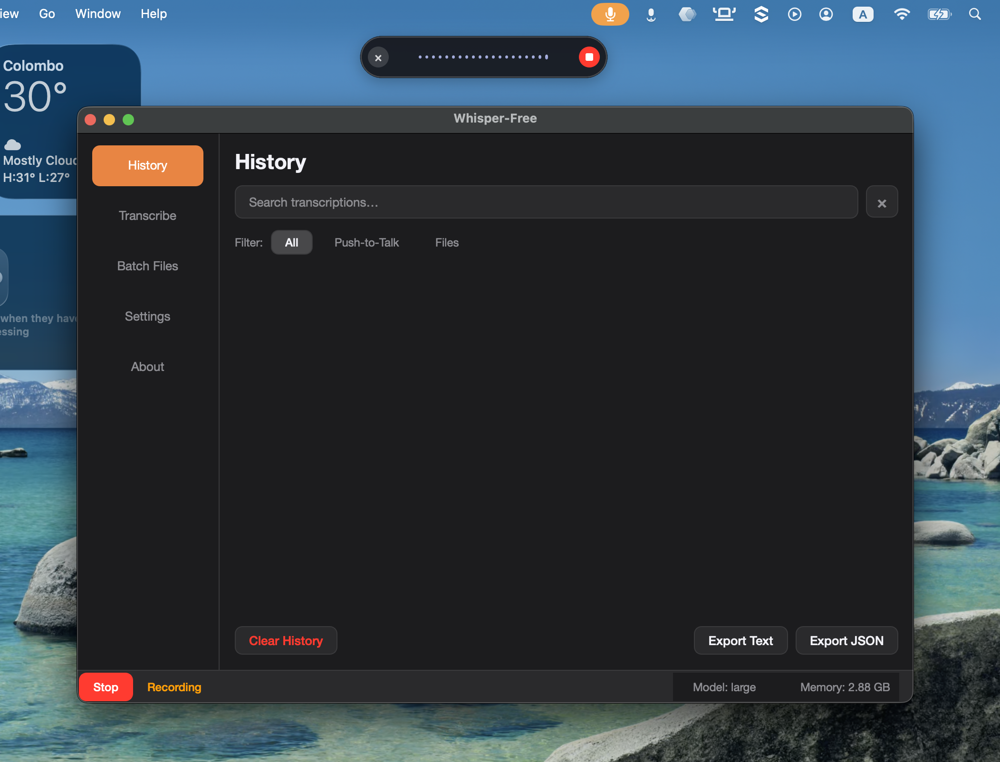</td>
    <td>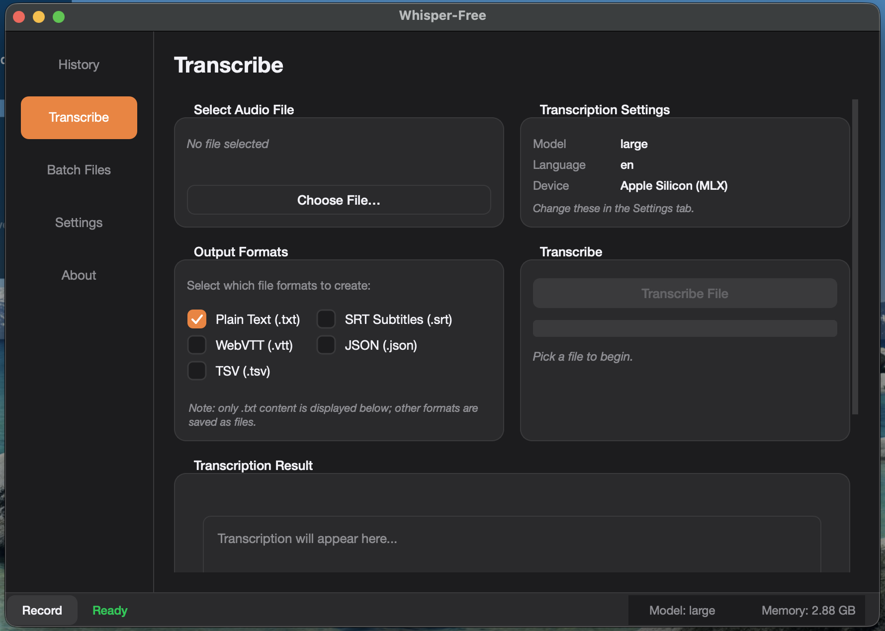</td>
  </tr>
  <tr>
    <td>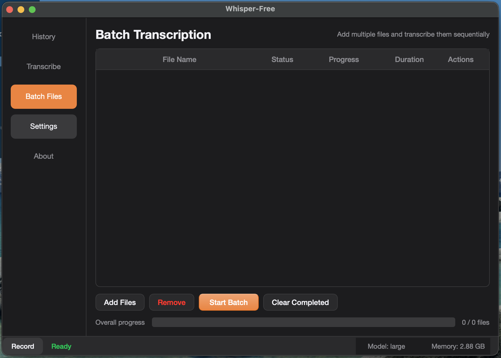</td>
    <td>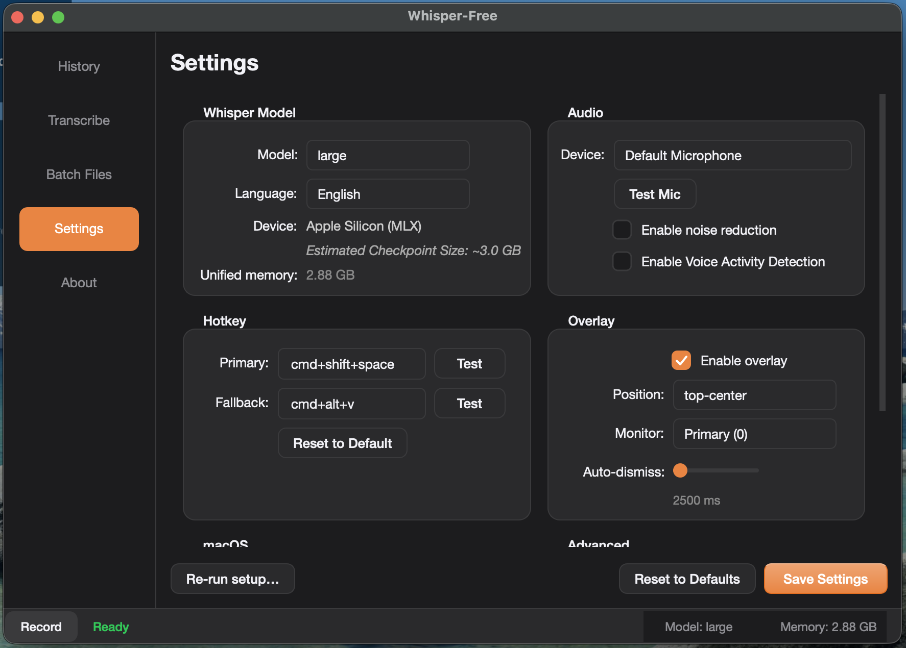</td>
  </tr>
</table>

### Linux

<table>
  <tr>
    <td>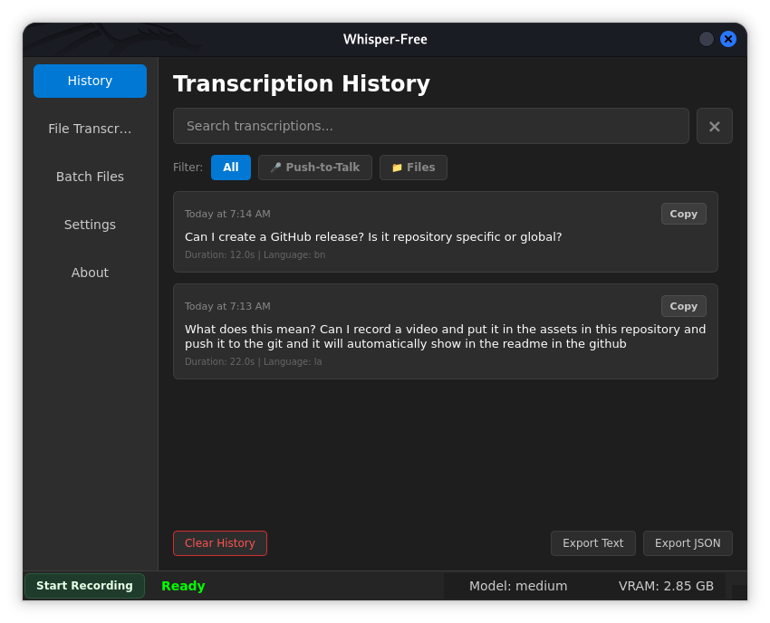</td>
    <td>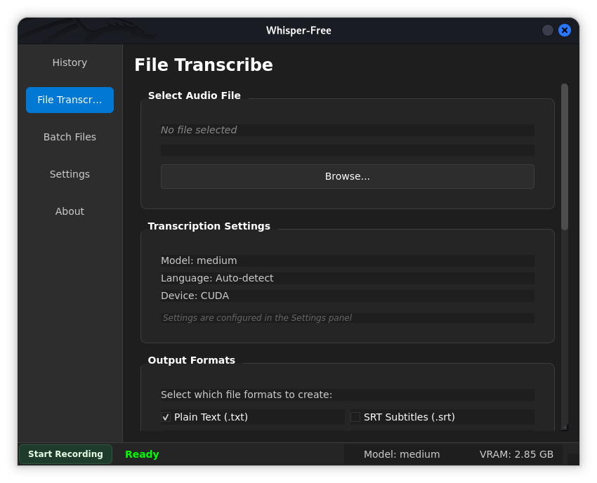</td>
    <td>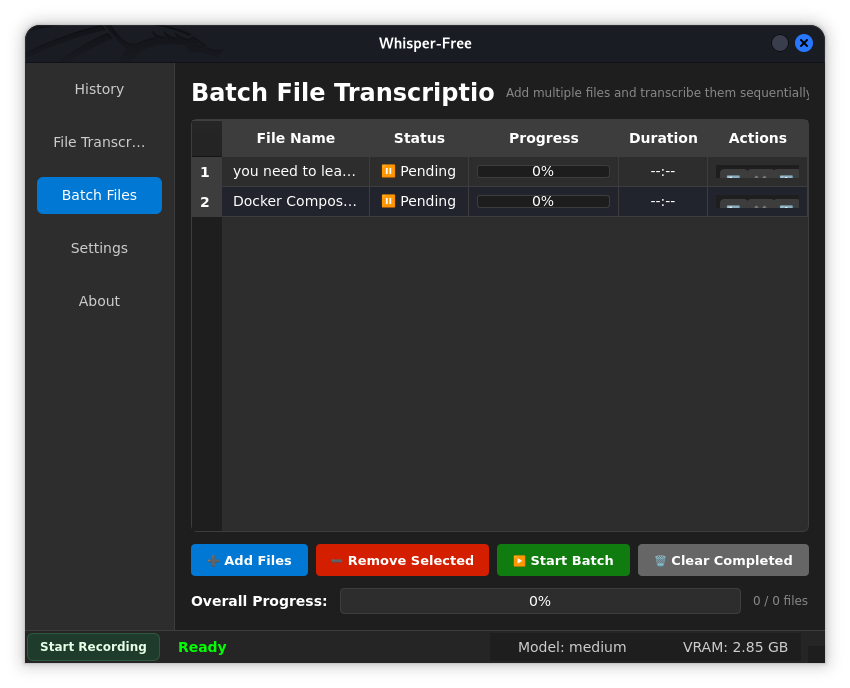</td>
  </tr>
  <tr>
    <td>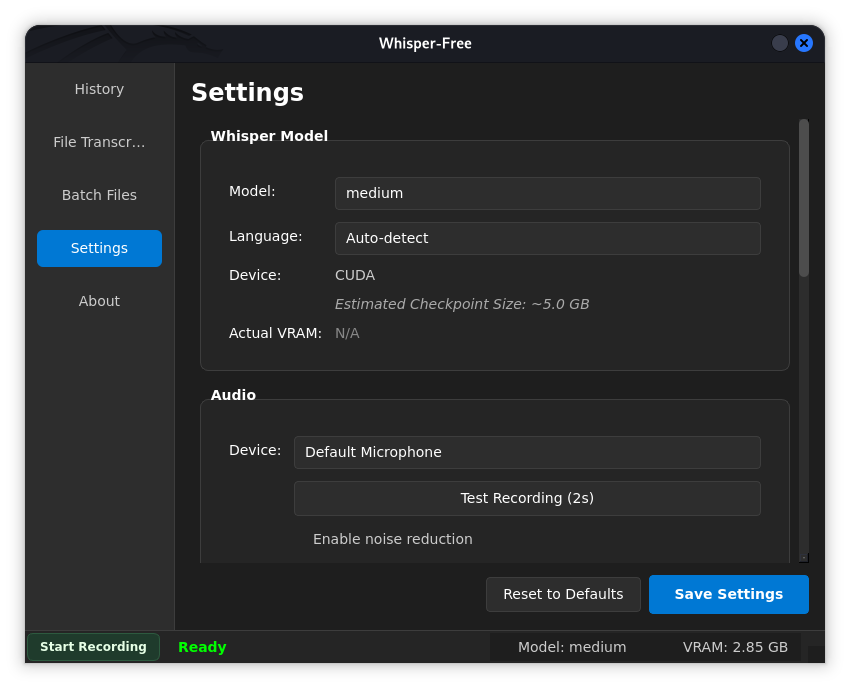</td>
    <td>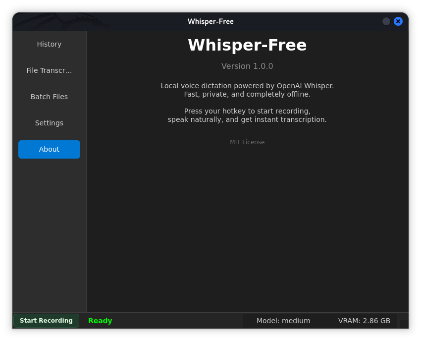</td>
    <td></td>
  </tr>
</table>

## Features

- Push-to-talk transcription with always-on-top overlay
- Live waveform + processing indicator
- Automatic clipboard copy on completion
- History panel of transcriptions
- File transcription (WAV/FLAC/OGG out of the box; MP3/M4A/WebM with ffmpeg)
- Configurable overlay position, monitor selection, and auto-dismiss timing

## Requirements

**Linux**
- Linux (tested on GNOME)
- Python 3.10+
- FFmpeg (required for MP3/M4A/WebM file transcription)
- At least 2 GB VRAM (NVIDIA GPU recommended; CPU fallback is slow)

**macOS** (new in v1.0.0)
- Apple Silicon Mac (M1, M2, M3, or M4) — **Intel Macs are not supported**
- macOS 13.5 Ventura or newer
- Python 3.10+ (only needed for source builds)
- FFmpeg (required for MP3/M4A/WebM file transcription)
- ~500 MB free disk space for the app + default `small` model

## Install using git repo

```bash
# 1) Clone
git clone https://github.com/pradeep512/Whisper-free.git
cd whisper-free

# 2) Create venv
python -m venv venv
source venv/bin/activate

# 3) Install deps (Linux)
pip install -r requirements-linux.txt

# 3) ...or install deps (macOS, Apple Silicon)
pip install -r requirements-macos.txt
```

Install ffmpeg if you plan to transcribe MP3/M4A/WebM:

```bash
# Linux
sudo apt-get install ffmpeg

# macOS
brew install ffmpeg
```

## Run

```bash
# Run directly
python -m app.main

# Or use the Makefile
make run
```

## Install CLI (`whisper` command)

```bash
make install
# Then run
whisper
```

## Wayland Note (GNOME)

On GNOME Wayland, precise overlay positioning is restricted. To keep the overlay pinned to the top-center, Whisper-Free automatically runs via XWayland when it detects Wayland.

- Default behavior on Wayland: uses XWayland for reliable positioning
- Force Wayland (for testing):

```bash
whisper --wayland
```

- Force XWayland explicitly:

```bash
whisper --xwayland
```

- Environment override:

```bash
# Always force XWayland
export WHISPER_FORCE_XWAYLAND=1

# Never force XWayland
export WHISPER_FORCE_XWAYLAND=0
```

## Hotkey Setup (GNOME)

1. Open Settings > Keyboard > Keyboard Shortcuts > Custom Shortcuts
2. Add a new shortcut:
   - Name: Whisper Toggle
   - Command: `whisper --toggle`
   - Shortcut: Ctrl+Space

This toggles recording start/stop and triggers transcription + clipboard copy.

## File Transcription

Open the "File Transcribe" tab and select an audio file. WAV/FLAC/OGG work without extra dependencies. For MP3/M4A/WebM, install ffmpeg.

See `archive/docs/README_FILE_TRANSCRIPTION.md` for detailed file transcription guidance.

## Troubleshooting

For known issues being tracked for the v1.0.0 macOS release, see [KNOWN_ISSUES.md](KNOWN_ISSUES.md).

- **Linux** — Overlay stuck in the middle on GNOME Wayland: ensure XWayland mode is active (default). Try `whisper --xwayland`.
- **Linux/macOS** — MP3/M4A won't load: install ffmpeg.
- **macOS** — Hotkey doesn't fire: System Settings → Privacy & Security → Accessibility → ensure Whisper-Free is listed and enabled. Re-add it if you replaced the app binary (Mac invalidates the entry on signature change).
- **macOS** — Microphone prompt didn't appear: open System Settings → Privacy & Security → Microphone → toggle Whisper-Free on. The system only prompts once per binary path.
- **macOS** — App "is damaged" error: this is Gatekeeper on a quarantined binary. Run `xattr -d com.apple.quarantine /Applications/Whisper-Free.app`, then re-launch.

## Project Layout

- `app/` main application code
  - `app/platform/{linux,macos}/` platform-specific shims (paths, hotkey perms, tray icon, autolaunch)
  - `app/ui/overlay.py` overlay UI
  - `app/ui/onboarding_wizard.py` first-launch permission wizard (macOS)
  - `app/core/whisper_engine.py` PyTorch backend (Linux: CUDA / CPU)
  - `app/core/whisper_engine_mlx.py` MLX backend (macOS: Apple Silicon)
- `scripts/whisper` CLI entry point (Linux)
- `scripts/whisper-free` CLI entry point (macOS)
- `scripts/build_macos.sh` one-shot macOS build script
- `packaging/appimage/` AppImage build artifacts (Linux)
- `packaging/macos/` PyInstaller spec + hooks (macOS)
- `packaging/homebrew/` Homebrew Cask formula
- `assets/` icon, screenshots, demo video
- `docs/` ARCHITECTURE, MACOS_PORT, BUILD_MACOS reference docs


## Install using AppImage (Split Parts)

Large AppImage files are provided as split parts in the GitHub Release assets.
Download all parts into the same folder, then reassemble:

```bash
cat Whisper-Free-x86_64.AppImage.part.* > Whisper-Free-x86_64.AppImage
chmod +x Whisper-Free-x86_64.AppImage
```

Optional checksum verification (if the release provides a `.sha256` file):

```bash
sha256sum -c Whisper-Free-x86_64.AppImage.sha256
```

Run the AppImage:

```bash
./Whisper-Free-x86_64.AppImage
```

### Show In App List (Desktop Menu)

To make the AppImage appear in your app list/search, create a desktop entry:

```bash
mkdir -p ~/.local/share/applications ~/.local/share/icons/hicolor/512x512/apps
cp Whisper-Free-x86_64.AppImage ~/.local/bin/whisper-free
chmod +x ~/.local/bin/whisper-free
cp assets/app-icon-512.png ~/.local/share/icons/hicolor/512x512/apps/whisper-free.png
```

Create `~/.local/share/applications/whisper-free.desktop` with:

```ini
[Desktop Entry]
Type=Application
Name=Whisper-Free
Comment=Local, privacy-first speech-to-text with overlay
Exec=/home/your-user/.local/bin/whisper-free
Icon=whisper-free
Terminal=false
Categories=AudioVideo;Utility;
StartupWMClass=Whisper-Free
```

Then refresh desktop databases:

```bash
update-desktop-database ~/.local/share/applications
gtk-update-icon-cache ~/.local/share/icons/hicolor
```

## Install on macOS

Whisper-Free on macOS runs as a **menu bar agent** (no Dock icon by default) and uses Apple's **MLX** framework for fast on-device transcription. Apple Silicon (M1+) only.

### Option 1: Homebrew Cask (recommended)

```bash
brew install --cask whisper-free
```

This installs `Whisper-Free.app` into `/Applications` and a `whisper-free` CLI shim into `/opt/homebrew/bin/` so you can trigger recording from Raycast / Alfred / Keyboard Maestro.

### Option 2: Direct DMG download

1. Download `Whisper-Free-<version>.dmg` from the [Releases page](https://github.com/pradeep512/Whisper-free/releases).
2. Open the DMG and drag `Whisper-Free.app` to `/Applications`.

### First launch: bypass Gatekeeper

Whisper-Free is currently **unsigned** — Apple Developer Program enrollment ($99/yr) is on the roadmap for a future release. Until then, macOS will block the first launch with:

> *"Whisper-Free" can't be opened because Apple cannot check it for malicious software.*

To bypass:

- **macOS 13–14**: Right-click `Whisper-Free.app` in Finder → **Open** → click **Open** in the dialog. macOS remembers this and won't ask again.
- **macOS 15 (Sequoia)** and newer: open **System Settings → Privacy & Security → Security**, scroll to the bottom, and click **"Open Anyway"** next to *"Whisper-Free was blocked"*. Then re-launch and confirm.

### First launch: grant permissions

An onboarding wizard guides you through the two macOS permissions Whisper-Free needs:

1. **Microphone access** — granted via a standard macOS system prompt. Click **OK**.
2. **Accessibility access** — needed for the global hotkey to work from any app. Click **Open Settings** in the wizard, then toggle **Whisper-Free** on in *Privacy & Security → Accessibility*. The wizard auto-detects when you've granted it.

### Using Whisper-Free on macOS

- **Menu bar icon**: click to start/stop recording. Right-click for "Open Window…" and "Quit".
- **Hotkey**: defaults to **Right Option** (single tap) on macOS, mirroring native Dictation. Configurable in *Open Window… → Settings → Hotkey*.
- **Main window**: opened on demand from the menu bar (or set *Settings → macOS → Show Whisper-Free in the Dock* if you prefer a Dock app).
- **Open at login**: toggle in *Settings → macOS → Open Whisper-Free at login*.

### Build the .app yourself (from source)

```bash
# Prerequisites
brew install create-dmg ffmpeg
python3.11 -m venv venv
source venv/bin/activate
pip install -r requirements-macos.txt

# Build .app + .dmg
./scripts/build_macos.sh
```

Outputs land in `dist/Whisper-Free.app` and `dist/Whisper-Free-<version>.dmg`. See `docs/BUILD_MACOS.md` for the full runbook.

## License

MIT
